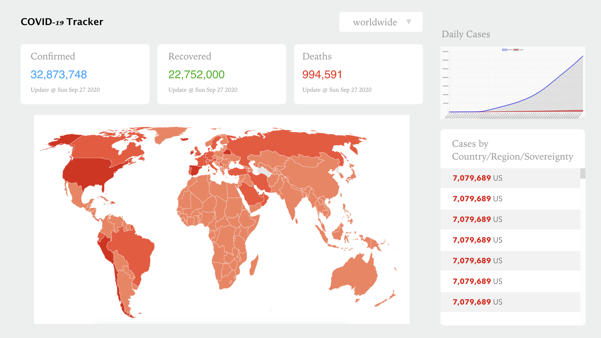

# COVID-19 Data Tracker

## notes

API:

- [https://disease.sh/](https://disease.sh/)
- [https://covid19.mathdro.id/api](https://covid19.mathdro.id/api)

- red: `#EE220C`
- green: `#1DB100`
- blue: `#00A2FF`
- bg grey: `#EDEFEF`
- text grey: `#929292`

### components/modules

- chart.js
- react-chartjs-2
- leaflet
- react-leaflet
- axios
- react-countup

**NOTE:** Need to give `.leaflet-container` a height & a width, otherwise it won't show up. And also need to add the default style of leaflet - `import "leaflet/dist/leaflet.css";`.

- Popup auto open: [https://stackblitz.com/edit/react-awtgn6](https://stackblitz.com/edit/react-awtgn6)

## screenshot



## read

- [React COVID Tracker](https://github.com/CleverProgrammers/react-covid-tracker)
- [COVID-19 Tracker](https://github.com/cyishere/covid-19-tracker)

---

I used this API `https://covid19.mathdro.id/api` at the beginning which made creating the 'Cases by Country/Region' list quite inconvenient, but because of this I learned a lot of **Promise**. Here's the code:

```js
import axios from "axios";

const url = "https://covid19.mathdro.id/api";

// Fetch data by region
const FetchByRegion = async (name) => {
  try {
    const {
      data: { confirmed, recovered, deaths },
    } = await axios.get(`${url}/countries/${name}`);
    return {
      name,
      confirmed,
      recovered,
      deaths,
    };
  } catch (error) {
    console.log("error", error.message);
  }
};

// Fetch data for regions
const fetchRegionData = async () => {
  try {
    const {
      data: { countries },
    } = await axios.get(`${url}/countries`);

    const regionNames = countries
      .filter((country) => country.name !== "Gambia")
      .map((country) => country.name);

    // let regionDatas = [];

    const regionDatas = regionNames.map(async (name) => {
      return await FetchByRegion(name);
    });

    return Promise.all(regionDatas);
  } catch (error) {
    console.log("error", error.message);
  }
};

export { fetchRegionData };
```
